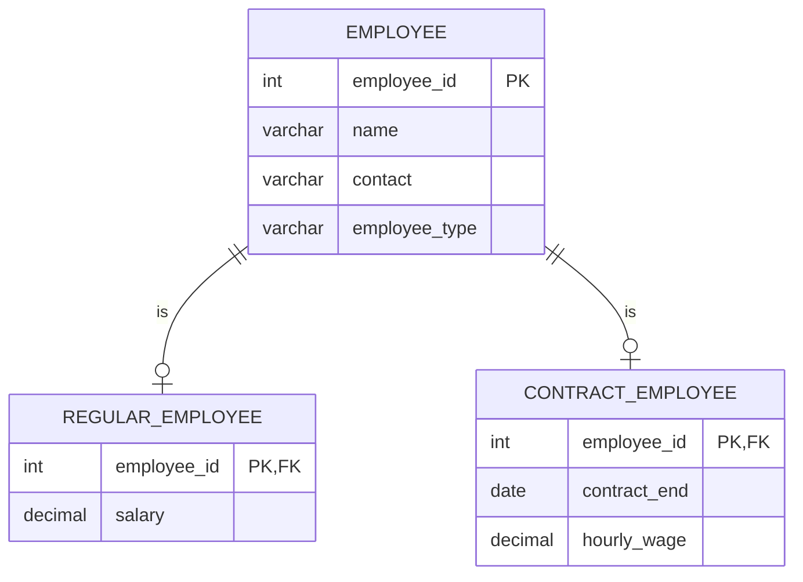

<!-- truncate -->

네이버 부스트캠프 9기 가 끝난 후, 안드로이드 팀의 그룹프로젝트 `Porring` 에 리팩토링 프로젝트에 참여하여 백엔드로 참여하면서 생긴 일이다.

## 슈퍼타입 - 서브타입 관계란?

ERD의 특정 관계를 뜻하는데, 정확하게는 **객체지향의 상속 개념과 유사한 데이터 모델링 패턴**이다.

### 슈퍼타입

예를 들어, 슈퍼타입은 **부모 클래스**에 해당하며, 공동 톳것ㅇ을 가진 일반적인 특징이 있다.

예를 들면 직원에 해당된다.

### 서브타입

서브타입은 슈퍼 타입의 **특수한 형태**로, 고유 속성을 추가로 지니는 특성이 있다.

예를 들면 그 직원이 정규직인지, 계약직인지 여부를 나타내는 세부 정보들을 뜻한다. 이때, **세부 정보에 해당되는 정보만 남기도록 한다.**

이를테면, 정규직이라면, `연봉` 데이터가 추가적으로 필요할 것이고 계약직이라면 `시급`과 `계약기간` 만이 필요할 것이다. 공통되는 정보는 `슈퍼타입` 에 넣도록 하자.

## 슈퍼타입 - 서브타입 관계의 활용 예시

실제로 `Porring` 프로젝트에서는 `OAuth` 를 지원해야하는데, 이때 활용할 수 있다.

일단 기본적으로 아래와 같이 **이메일 로그인**과 **OAuth** 로그인 방식 두가지로 가입된 유저 유형이 있을 것이다.


유저의 기본적인 정보는 `유저` 테이블에 저장하고, 로그인 방식에 따라 이메일 기반일 경우 해당되는 이메일 만을 서브 타입으로써 저장하고, OAuth 로그인이라면 `OAuth` 제공자와 리프레쉬토큰(예시) 를 저장할 수 있겠다.

### 데이터베이스에서 실제로 접근하는 방법은?

다른 예시를 들어보자. 

예를 들어, 직원이 정규직인지, 계약직인지 상세하게 구별하고 싶다.

하지만 이때, 특정 '직원'이 정규직인지, 계약직인지를 **어떻게 데이터베이스 에서 확인할 수 있을까?**



이때는 직원 테이블의 `EMPLOYEE_TYPE` 이라는 별도의 값으로 구별한 후, 서브 타입에는 `PK`로 직원 ID를 `FK` 로 선언한 상황이다.

이렇게 된다면, 직원 조회 시, `EMPLOYEE_TYPE` 을 사용하여 해당되는 서브타입 테이블과 `JOIN` 하여 확인할 수 있다.

### 성능이 저하 될 때

하지만, 그렇다면 또다시 의문이 들 것이다.

유저를 조회할 때마다 `JOIN` 을 사용하면 성능에 영향이 가지 않을까 라는 것이다.

데이터의 정합성을 위해서는 `JOIN` 하는게 맞지만, `서브 쿼리`를 활용할 수도 있을 것이다.

1. 유저 테이블만 검색하기
2. 유저테이블로부터 유형 알아내기
3. 알아낸 유형으로 유저의 ID로 해당 테이블로부터 검색하기

그럴 경우, 아래와 같은 방법으로도 활용할 수 있다.

```sql
-- 직원 기본정보 조회
SELECT * FROM EMPLOYEE WHERE employee_id = 1;

-- 직원유형에 따른 상세정보 조회
SELECT 
  CASE 
    WHEN e.employee_type = 'REGULAR' THEN 
      (SELECT salary FROM REGULAR_EMPLOYEE WHERE employee_id = e.employee_id)
    WHEN e.employee_type = 'CONTRACT' THEN 
      (SELECT hourly_wage FROM CONTRACT_EMPLOYEE WHERE employee_id = e.employee_id)
  END AS payment_info
FROM EMPLOYEE e 
WHERE e.employee_id = 1;
```

그럼에도 성능저하가 일어날 경우, 테이블을 합치고, `NULLABLE` 을 허용하는 수 밖에 없다. 쉽게 말해서 **반정규화 하는 수밖에 없을 것이다.**

